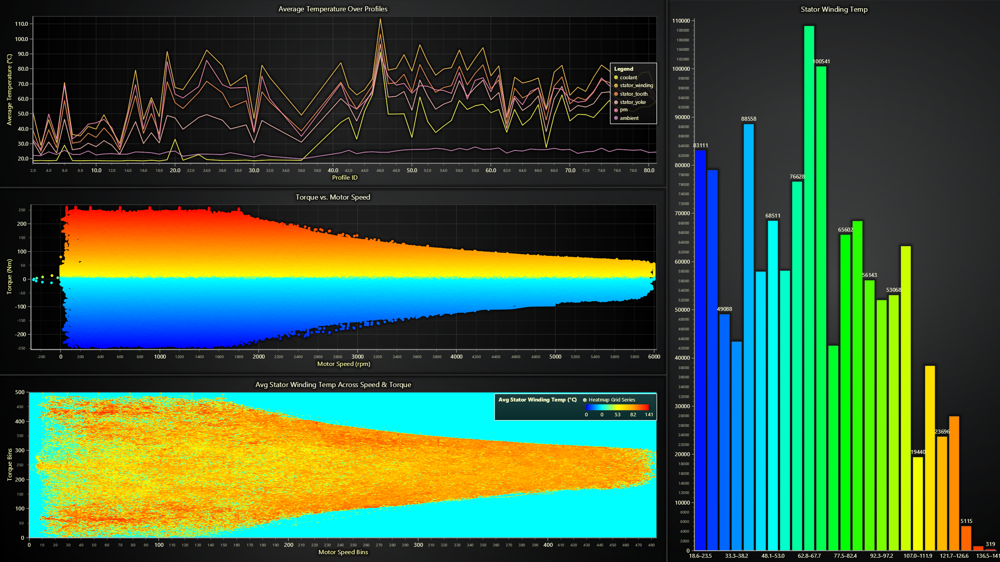

# **Electric Motor Temperature Dashboard with LightningChart Python**

## Introduction

Monitoring and analyzing temperature variations in electric motors is essential for optimizing performance and ensuring operational efficiency. This project presents a Python-based dashboard built with **LightningChart Python**, enabling the visualization of key motor parameters, including temperature, torque, and motor speed.

## LightningChart Python

**LightningChart Python** is a high-performance visualization library that enables developers to create advanced visualizations with optimized rendering. It is particularly useful for working with large datasets, making it well-suited for this electric motor analysis project.

### Key Features of LightningChart Python:

* **Optimized rendering** for handling large datasets.
* **Interactive charts** with dynamic customization.
* **Comprehensive support** for multiple chart types including line charts, scatter plots, histograms, and heatmaps.

## Setting Up the Python Environment

To set up the Python environment for this project, you need to install Python and the necessary libraries such as LightningChart Python and OpenSky Network API.

1. **Install Python**: Download and install the latest version of Python from the [official website](https://www.python.org/).
2. **Install Libraries**: Use `pip` to install the required libraries:
   ```bash
   pip install lightningchart pandas numpy
   ```
3. Set up your development environment by creating a new project directory and installing the required libraries. Ensure that LightningChart Python is properly licensed.

### **Dataset Extraction**

The dataset is provided in a compressed `.7z` file to reduce repository size. Before running the code, please extract the dataset found inside the `dataset` folder.

## Overview of Libraries

This project utilizes several key Python libraries:

* **Pandas:** For data manipulation and analysis. ([Documentation](https://pandas.pydata.org/docs/))
* **NumPy:** For numerical computations, particularly in data binning and transformations. ([Documentation](https://numpy.org/doc/stable/))
* **LightningChart Python:** For visualization and dashboard creation. ([Documentation](https://lightningchart.com/python-charts/docs/))

## Dashboard Implementation

The core of this project is the **Electric Motor Temperature Dashboard**, which consists of multiple visualizations:

### Line Chart: Average Temperature Over Profiles

This line chart visualizes the average temperature of different components over multiple measurement sessions (profile IDs). The temperatures analyzed include **coolant, stator winding, stator tooth, stator yoke, permanent magnet (pm), and ambient temperature**.

```python
# LINE CHART: TEMPERATURE TRENDS
chart_line = dashboard.ChartXY(column_index=0, row_index=0, column_span=2)
chart_line.set_title("Average Temperature Over Profiles")

# Group data by profile_id and compute average temperature values
df_avg_temp = df.groupby("profile_id")[["coolant", "stator_winding", "stator_tooth", "stator_yoke", "pm", "ambient"]].mean().reset_index()

# Plot each temperature series dynamically
for col in ["coolant", "stator_winding", "stator_tooth", "stator_yoke", "pm", "ambient"]:
    series = chart_line.add_line_series(data_pattern='ProgressiveX')
    series.append_samples(df_avg_temp["profile_id"].tolist(), df_avg_temp[col].tolist()).set_name(col)
```

### Histogram: Stator Winding Temperature Distribution

A histogram is used to analyze the distribution of **stator winding temperature**, helping identify its range and frequency.

```python
# HISTOGRAM: STATOR WINDING TEMPERATURE DISTRIBUTION
chart_histogram = dashboard.BarChart(column_index=2, row_index=0, column_span=1, row_span=3)
chart_histogram.set_title("Stator Winding Temp")

# Compute histogram bins
num_bins = 25
counts, bin_edges = np.histogram(df["stator_winding"].dropna(), bins=num_bins)
bar_data = [{"category": f"{bin_edges[i]:.1f}–{bin_edges[i+1]:.1f}", "value": int(count)} for i, count in enumerate(counts)]
chart_histogram.set_data(bar_data)
```

### Scatter Plot: Torque vs. Motor Speed

This scatter plot provides insights into the relationship between **torque and motor speed**, with color gradients representing variations in torque values.

```python
# SCATTER PLOT: TORQUE VS MOTOR SPEED
chart_scatter = dashboard.ChartXY(column_index=0, row_index=1, column_span=2)
chart_scatter.set_title("Torque vs. Motor Speed")
point_series = chart_scatter.add_point_series(data_pattern='ProgressiveY')
point_series.add(df["motor_speed"], df["torque"])
```

### Heatmap: Average Stator Winding Temperature Across Speed & Torque

This heatmap represents the average **stator winding temperature** as a function of **motor speed and torque**. Higher temperatures are visually distinguished through a color gradient.

```python
# HEATMAP: TEMPERATURE ACROSS SPEED & TORQUE
chart_heatmap = dashboard.ChartXY(column_index=0, row_index=2, column_span=2)
chart_heatmap.set_title("Avg Stator Winding Temp Across Speed & Torque")
heatmap_series = chart_heatmap.add_heatmap_grid_series(columns=500, rows=500)
heatmap_series.invalidate_intensity_values(heatmap_array.tolist()) 
```

## Final Dashboard

Bringing all visualizations together, the final dashboard provides an interactive and comprehensive analysis of electric motor behavior.



1. **Top Left**: Line chart showing average temperature trends.
2. **Right**: Histogram of stator winding temperature distribution.
3. **Middle**: Scatter plot for torque vs. motor speed.
4. **Bottom**: Heatmap displaying temperature variations across motor speed and torque.

## Conclusion

This project demonstrates the effectiveness of **LightningChart Python** in creating an advanced **Electric Motor Temperature Dashboard**. With optimized rendering and interactive visualizations, this dashboard enables detailed motor analysis, improving insights into temperature behavior, torque, and performance characteristics. The techniques applied in this project can be extended to real-world industrial applications for monitoring and predictive maintenance of electric motors.

## Sources

[Dataset](https://www.kaggle.com/datasets/wkirgsn/electric-motor-temperature/data)
